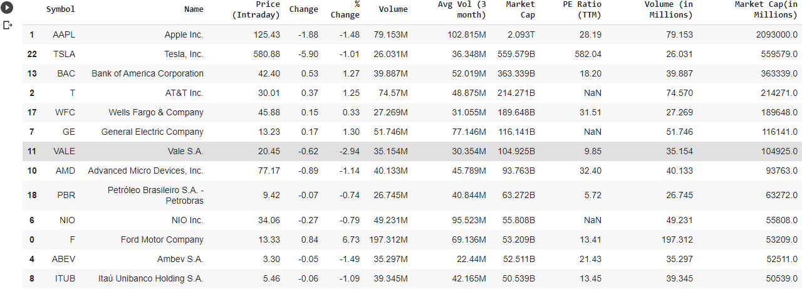
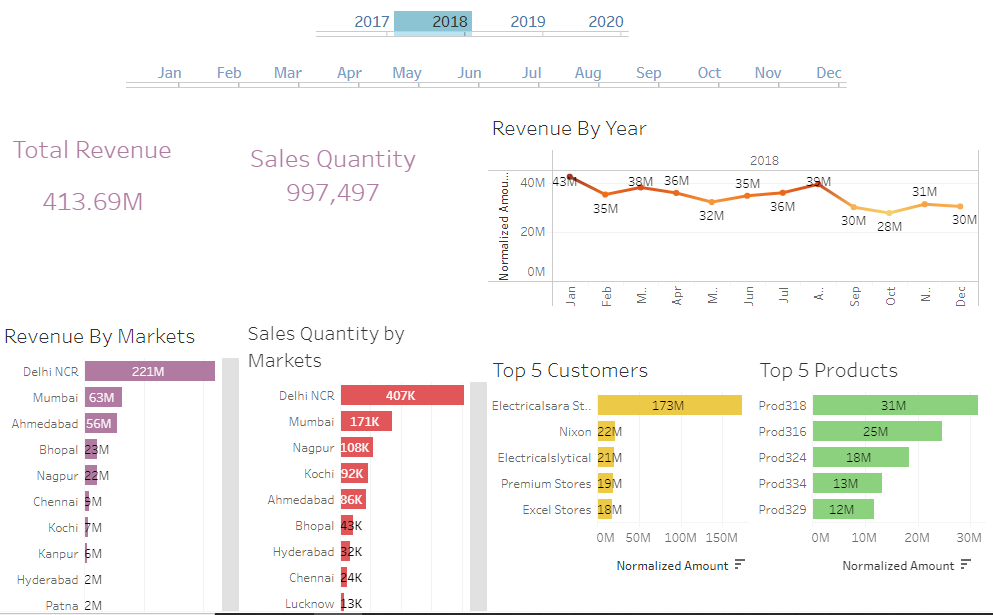

# Medinah1

[Projects](README.md) | [Resume](resume.md) |[About Me](About.md)

### Latest Projects

### [Banglore Housing Project](https://colab.research.google.com/gist/Gongola/5d02997d95c0d3edfea5ff8567ade2f8/banglore-housing.ipynb)
This project is targeted at Home buyers considering getting new homes in Banglore region of India. A Price prediction model would be used to estimate prices of homes based on location, total square feet, number of bathrooms.
- **Python** was the underlying language used in creating this tool.
- **Pandas** and **Numpy** were used for storing and manipulating the data retrieved.
- **Matplotlib** was used for data visualization.
- **Sklearn** was used for model building.

### [Determining Viable Stocks](https://colab.research.google.com/drive/1qyWQ6ok4GtmuuEdAr1L0NY9Gmn2AwOyl#scrollTo=Yc0s9snYJsir)
This project was developed for TerraCorp ltd. It allows them to identify active stocks for Investment purposes
- **Python** was the underlying language used in creating this tool.
- **Requests** was the python library used to retrieve information from the Indeed page.
- **Pandas** library was used for storing and manipulating the data retrieved.
- 

### [Sales insight for Panele Group](https://prod-useast-a.online.tableau.com/#/site/medinah/workbooks/434532?:origin=card_share_link)
This project was developed for Panele group shareholders to generate sales insights to understand revenue breakdown by cities, years and months, show top 5 customers and top 5 products
- **Tableau** was the tool used for data cleaning and ETL(Extract, Transform, Load), as well as data visualization (creation of dashboard)
- **MySql** was the database used for storing and cleaning the data
- 
