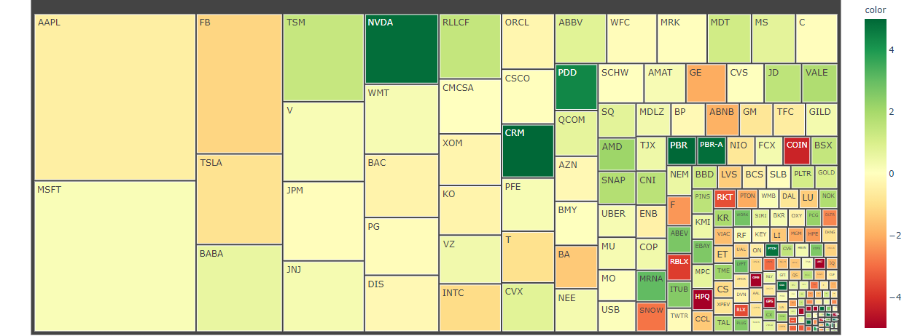

# Medinah1

[Projects]() | [Resume](resume.md) |[About Me](about.md)

### Latest Projects

### [Data Scraping from  times.com](https://colab.research.google.com/gist/Gongola/a123b219e4521764a31e13fcbd50fbd1/data-scraping.ipynb)

### [Indeed Scraper](https://colab.research.google.com/gist/Gongola/667c5f0740a6bc989aff052e7b014b31/indeed-scraper.ipynb)
This project is targeted at aspiring job applicants. It allows a job seeker to enter a search criteria. It returns a list of recently posted jobs on indeed to the user
- **Python** was the underlying language used in creating this tool.
- **Requests** was the python library used to retrieve information from the Indeed page.
- **Pandas** library was used for storing and manipulating the data retrieved.

### [Determining Viable Stocks](https://colab.research.google.com/drive/1qyWQ6ok4GtmuuEdAr1L0NY9Gmn2AwOyl#scrollTo=Yc0s9snYJsir)
This project was developed for TerraCorp ltd. It allows them to identify active stocks for Investment purposes
- **Python** was the underlying language used in creating this tool.
- **Requests** was the python library used to retrieve information from the Indeed page.
- **Pandas** library was used for storing and manipulating the data retrieved.
- 

### [Visualizing Viable Stocks](https://colab.research.google.com/drive/15_xLM1MUnoYg2h0o6Iv2ZGgYU5kZkdiE)
This project was developed for TerraCorp ltd. It allows them to identify active stocks for Investment purposes
- **Python** was the underlying language used in creating this tool.
- **Requests** was the python library used to retrieve information from the Indeed page.
- **Pandas** library was used for storing and manipulating the data retrieved.
- 
